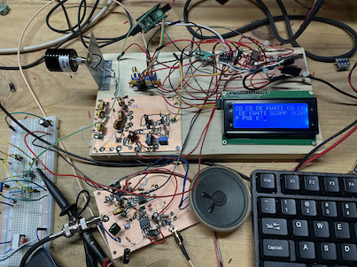

Overview
========

A simple SCAMP station based on the specification by Daniel Marks (KW4TI).  Target processor
is the RP2040 (Pi Pico).

Updating
========
        git submodule update --recursive --remote

Flash
=====

        openocd -f interface/raspberrypi-swd.cfg -f target/rp2040.cfg -c "program main.elf verify reset exit"

Copyright
=========

Copyright (C) 2023 - Bruce MacKinnon KC1FSZ

This work is covered under the terms of the GNU Public License (V3). Please consult the LICENSE file for more information.

This work is being made available for non-commercial use by the amateur radio community. Redistribution, commercial use or sale of any part is prohibited.
